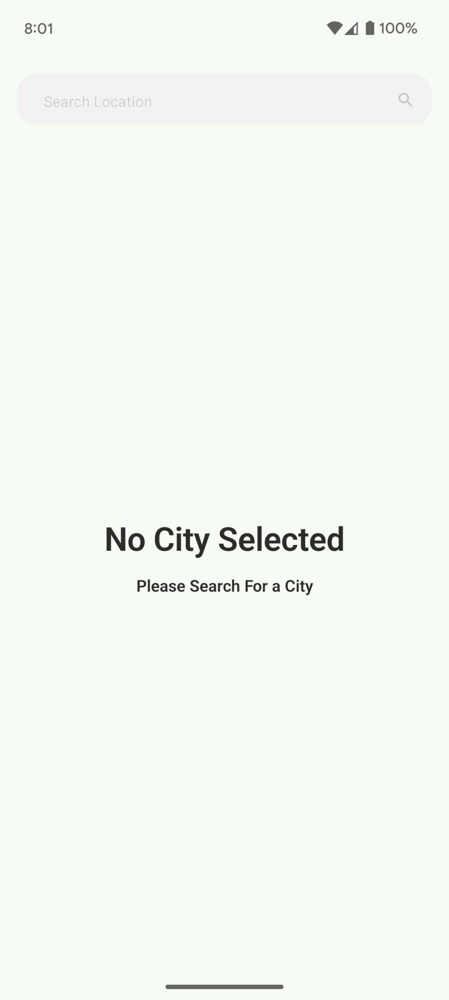
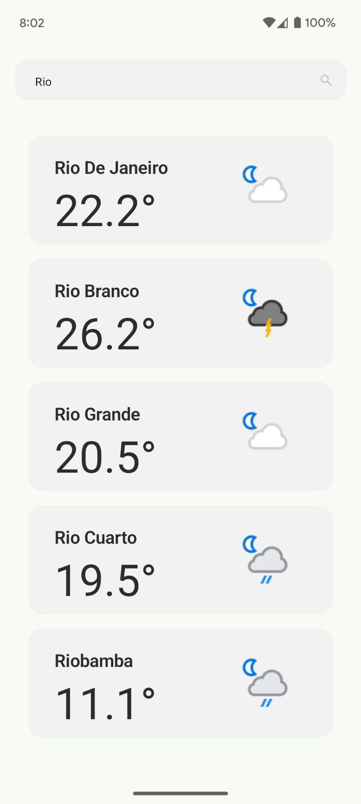
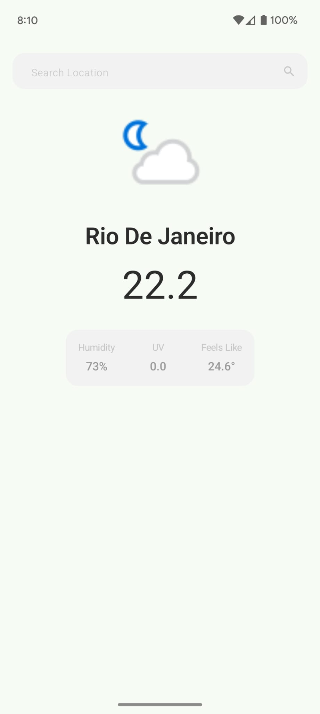

# Weathertracker

# Weather Tracker

Weather Tracker is a simple and useful app to check the weather wherever you are. It’s designed to
make tracking weather conditions easy and intuitive.

Whether you're exploring the code or just curious about how it works, this project is built to be
straightforward and fun to use.

---
## Screenshots

### Home Screen

*Dimensions: 1080 x 2340 px (18:9 aspect ratio)*

### Search Functionality

*Dimensions: 1080 x 2340 px (18:9 aspect ratio)*

### Weather Details

*Dimensions: 1080 x 2340 px (18:9 aspect ratio)*

---

## Setup Instructions

### 1. Clone the Repository

```bash
git clone https://github.com/mauriciosartori/weather-tracker.git
cd weather-tracker
```

### 2. Add Your Weather API Key

This project uses [WeatherAPI.com](https://www.weatherapi.com/) to fetch weather data. To run the
app, you must provide your own API key.

#### Steps to Add Your API Key:

1. Obtain a free API key from [WeatherAPI.com](https://www.weatherapi.com/).
2. Create a `gradle.properties` file in the root of the project (if it doesn’t already exist).
3. Add the following line to the `gradle.properties` file:

   ```properties
   WEATHER_API_KEY=your_api_key_here

## Tech Stack

- **Kotlin**: Modern programming language for Android development.
- **Jetpack Compose**: Toolkit for building declarative UIs.
- **Hilt**: Dependency injection framework.
- **Retrofit**: Networking library for API calls.
